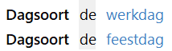
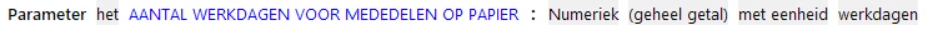
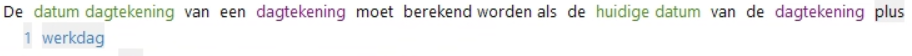
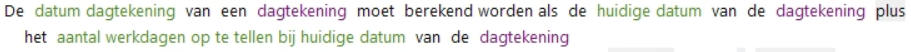

# Dagsoort

De dagen van de week (zaterdag, zondag etc.) zijn in ALEF standaard beschikbaar. Daarnaast kunnen specifieke dagsoorten worden gedefinieerd worden. Deze dagsoorten kunnen als eenheid van een attribuut met datatype Numeriek gebruikt worden.
Dagsoorten kunnen in regels gebruikt worden om bijvoorbeeld te controleren of een bepaalde datum een feestdag is (oftewel wanneer het een Nieuwjaarsdag, Paasdag, Koningsdag, Hemelvaartsdag, Pinksterdag of Kerstdag is), of om bijvoorbeeld een aantal werkdagen op te tellen bij een datum (zo kunnen feestdagen worden overgeslagen bij het optellen van dagen bij een datum).

Een dagsoort wordt gedefinieerd in regels met de actie [DagsoortDefinitie](../regels/Actie_Dagsoortdefinitie.md).

Een dagsoort kan worden gebruikt als eenheid en worden toegevoegd aan datatypes bij attributen en parameters. In plaats van met standaard tijdseenheden kan dan gerekend worden met een tijdsduur op basis van de specifieke dagsoort. 

Dagsoorten kunnen worden gebruikt in regels voor afleiding van datums of tijdsduur waarbij rekening moet 
worden gehouden met speciale datums.

of

N.B. Het attribuut "aantal werkdagen op te tellen bij huidige datum" heeft als datatype "Numeriek (geheel getal) met eenheid werkdagen".

## Dagsoortdefinitie

In een [dagsoortdefinitie](../regels/Actie_Dagsoortdefinitie.md) worden voorwaarden opgenomen om concreet te bepalen wanneer een datum van dat dagsoort is.
