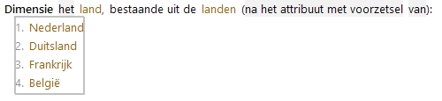
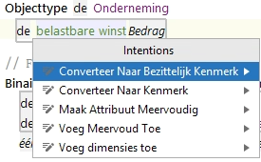
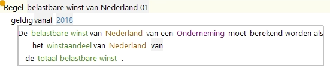

# Dimensies

Bij attributen waarvoor in verschillende situaties verschillende waarden gelden, kunnen dimensies worden gespecificeerd. Bijvoorbeeld op verschillende momenten, of in verschillende vestigingen.
Hiermee wordt voorkomen dat in het gegevensmodel heel veel aparte attributen moeten worden opgenomen.
Het inkomen van een persoon zal bijvoorbeeld niet elk jaar hetzelfde zijn, en het zou hierbij niet handig zijn om voor elk jaarinkomen een afzonderlijk attribuut te moeten specificeren. In plaats daarvan kan echter het attribuut *inkomen* met een dimensie *jaardimensie* gespecificeerd worden. Bij gebruik van *inkomen* in een regel moeten we aangeven welk inkomen uit welk jaar er wordt bedoeld.

Een attribuut kan meerdere dimensies hebben. Een inkomen kan bijvoorbeeld naast voornoemde jaardimensie ook een netto- of een bruto-inkomen zijn. Om dat vast te leggen kunnen we een tweede dimensie toevoegen aan het attribuut inkomen.
Bij gebruik van dat attribuut dienen dan altijd alle dimensies te worden aangegeven aangezien het anders niet duidelijk is welke specifieke waarde bedoeld wordt. We moeten dus expliciet aangegeven of het, het netto- dan wel bruto-inkomen van vorig jaar betreft.

Dimensies kunnen op twee manieren in RegelSpraak-regels worden weergegeven.

1. De eerste manier is *na het attribuut met voorzetsel* waarbij gekozen kan worden tussen voorzetsels *van, in, voor, over, op, bij en uit*. Bij verwijzing naar het attribuut wordt dan eerst het attribuut genoemd, dan het gedefinieerde voorzetsel, en dan het label van de dimensie. Als we bijvoorbeeld het voorzetsel van definiëren voor de dimensie over jaren, dan spreken we over het *inkomen van huidig jaar*.
2. De tweede manier is voor *het attribuut als bijvoeglijk naamwoord*. Het label van de dimensie wordt dan direct voor het attribuut geplaatst. Als we dit bijvoorbeeld definiëren voor de dimensie over bruto en netto, dan spreken we over het *bruto inkomen*.

## Voorbeelden

De belastbare winst moet worden verdeeld over verschillende landen. In het gegevensmodel wordt de dimensie "Land" gespecificeerd met waardenlijst van landen:

De dimensie wordt toegewezen aan een attribuut:

Door het toevoegen van de dimensie "land" aan het attribuut "belastbare winst" kunnen regels worden gemaakt met de combinatie van attribuut en dimensie:

