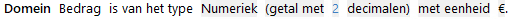
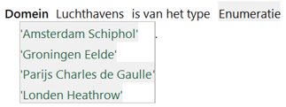

# Domeinen

Een **domein** is de definitie van een project-specifiek [datatype](datatype.md) in een objectmodel. Dit kan gebruikt worden voor attributen en [parameters](parameter.md). Een domein wordt geïdentificeerd door een unieke naam en is qua inhoud een gespecificeerde verzameling van mogelijke waarden. Deze gespecificeerde verzameling kan gebaseerd zijn op een standaarddatatype (met uitzondering van de boolean), al dan niet met beperking, of het kan een lijst met mogelijke enumeratiewaarden zijn.

## Domein op basis van een standaarddatatype

Een geldbedrag is vaak een getal met 2 decimalen. Het is daarom mogelijk om een domein *Bedrag* te specificeren met als datatype *Numeriek* en met nadere beperking *getal met 2 decimalen*.
We kunnen daarna alle attributen die een bedrag representeren als datatype het domein *Bedrag* geven en geven daarmee aan dat elk bedrag numeriek is met 2 decimalen.

Op deze manier kunnen definities van objecttypen begrijpelijker worden gemaakt en kan een vaak voorkomende soort waarde (zoals een bedrag) op een centrale plek eenduidig gedefinieerd worden.

Domein met eigen naam o.b.v. algemeen datatype

## Domein op basis van een enumeratie

In plaats van het gebruik van een van de standaarddatatypes bij de definitie van een domein kan een domein ook gespecificeerd worden met een zogenaamde **enumeratie**.
Een enumeratie is een vooraf-gedefinieerde uitputtende lijst met waarden die een attribuut of parameter kan aannemen.
Er is in het voorbeeld slechts een beperkt aantal luchthavens waarvandaan een vlucht kan vertrekken. Deze luchthavens kunnen expliciet benoemd worden in een (enumeratie)lijst.
Deze lijst kunnen we als domein specificeren en attributen met dit domein kunnen dan alleen een waarde uit deze lijst aannemen.

Domein met waardenlijst o.b.v. datatype Enumeratie

