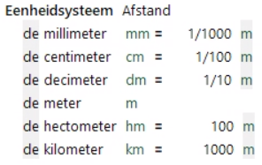
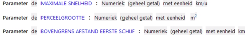

# Eenheidssystemen

Eenheidssystemen bevatten de specificatie van een set gerelateerde basiseenheden met hun omrekenfactor. Bijvoorbeeld afstand of hoeveelheid elektrische energie.

De basiseenheden moeten van klein naar groot in de lijst worden geplaatst met de bijbehorende omrekenfactor naar een andere basiseenheid. Een eenheid heeft een naam, een afgekorte notatie en een symbool.

In regels worden de omrekenfactoren uit het eenheidssysteem automatisch toegepast. Bij gebruik van bovenstaand eenheidssysteem wordt een attribuut in kilometers dus door ALEF omgerekend naar meters.

Een eenheid uit een eenheidssysteem kan bij attributen en parameters worden toegevoegd aan de datatypes Numeriek en Percentage in het [objectmodel](objectmodel.md). Hierbij kunnen eenheidssystemen ook in combinatie gebruikt worden.

