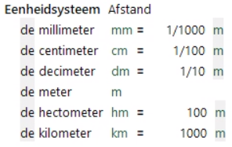
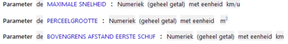

# Eenheidssystemen

Overal waar het numeriek [datatype](datatype.md) een rol speelt, zijn eenheden mogelijk van toepassing.
Een afstand kan bijvoorbeeld in meters of in kilometers zijn en een leeftijd wordt meestal uitgedrukt in jaren.
Bij berekeningen moet vervolgens wel rekening gehouden worden met eenheden. Zo is het niet logisch en dus niet mogelijk om meters bij jaren op te tellen.

Voordat een eenheid toegekend kan worden aan een attribuut of parameter (met percentage of numeriek datatype) moet deze eerst gespecificeerd worden.
Een eenheid wordt gespecificeerd met een eenheidssysteem: een eenheidssysteem beschrijft de te gebruiken basiseenheden door middel van een naamwoord, eventueel hun afkorting en/of symbool, en eventueel een omrekenspecificatie waarmee de basiseenheid omgerekend kan worden in een andere basiseenheid uit hetzelfde eenheidssysteem.
Als we bijvoorbeeld de eenheid Euro willen gaan gebruiken, dan moeten we een eenheidssysteem specificeren waarin de euro een basiseenheid is. Verder kunnen we dan specificeren dat de euro afgekort wordt tot EUR en het symbool € heeft.
De basiseenheden moeten van *klein naar groot* in de lijst worden geplaatst met de bijbehorende omrekenfactor naar een andere basiseenheid. In regels worden de omrekenfactoren automatisch toegepast.

Als we de basiseenheid hebben gespecificeerd in een eenheidssysteem, dan kunnen we hem toekennen aan een attribuut of parameter. Dit doen we door *met eenheid* achter het datatype of de domeinnaam te zetten, gevolgd door de naam van de basiseenheid. In GegevensSpraak ziet dat er als volgt uit bij een attribuut:

**Samengestelde eenheden** kunnen ook gespecificeerd worden. De basiseenheden uit de eenheidssystemen kunnen immers door middel van delingen of vermenigvuldigingen gecombineerd worden. Een snelheid heeft bijvoorbeeld een samengestelde eenheid, veelal het aantal kilometers gedeeld door het aantal uren waardoor kilometers per uur als samengestelde eenheid ontstaat. In het objectmodel kunnen we dit specificeren door een deelstreepje “/” te zetten tussen beide basiseenheden.

In het voorbeeld met  gecombineerde eenheden werden twee verschillende basiseenheden voor afstand gebruikt, namelijk de meter (m) en de kilometer (km).
Deze twee basiseenheden kunnen in elkaar omgerekend worden: een kilometer is gelijk aan 1000 meter. Dit kan bij elk eenheidssysteem ook gespecificeerd worden door het opgeven van een omrekenspecificatie.
Een omrekenspecificatie specificeert voor een basiseenheid een omrekenfactor waarmee de betreffende basiseenheid omgerekend kan worden in een andere basiseenheid uit hetzelfde eenheidssysteem.
De omrekenfactor bestaat uit een getal, eventueel een deelstreepje, en de basiseenheid waarop de omrekenfactor betrekking heeft.
Bij het specificeren van omrekenfactoren is het van belang dat de basiseenheden op volgorde van toenemende grootte staan. De kleinste basiseenheid dient als eerste gespecificeerd te worden.
Omrekenspecificaties zijn optioneel. De basiseenheid *meter* heeft in bovenstaande specificatie bijvoorbeeld geen omrekenspecificatie.

GegevensSpraak kent echter geen speciale betekenis toe aan basiseenheden die geen omrekenfactor hebben: ze zijn evengoed omrekenbaar als een andere basiseenheid naar hen verwijst.
Het is echter overbodig om bij beide basiseenheden een omrekenfactor te specificeren, mede daarom dat omrekenspecificaties optioneel zijn.
Binnen eenheidssystemen kan het voorkomen dat er basiseenheden bestaan die niet direct in elkaar kunnen worden omgerekend. Een maand heeft bijvoorbeeld geen vast aantal dagen: we kunnen daardoor maanden niet direct omrekenen in dagen. In een dergelijk geval gebruiken we dan ook geen omrekenspecificatie.

## Standaard eenheidssystemen

*Standaard eenheidssystemen* die onderdeel zijn van GegevensSpraak, zijn:

* Het eenheidssyteem voor Valuta (gebaseerd op ISO-4217).
Dit eenheidssyteem bevat geen omreken factoren.
* Het eenheidssysteem Tijd.
Hieronder de specificatie van dat eenheidssysteem

### Eenheidssysteem Tijd

* de milliseconde (ms)   = 1/1000 s
* de seconde     (s)     = 1/60 minuut
* de minuut              = 1/60 u
* de uur         (u)     = 1/24 dg
* de dag        (dg)
* de week       (wk)    = 7 dg
* de maand      (mnd)
* het kwartaal  (kw)    = 3 mnd
* het jaar      (jr)    = 12 mnd
