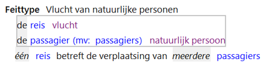

# Feittypen

Feittypen specificeren de relaties tussen objecttypen.
In het voorbeeld is er een relatie tussen natuurlijk persoon en vlucht: een vlucht heeft nu eenmaal passagiers en die passagiers zijn natuurlijke personen.
Een feittype bestaat uit rollen die gespeeld worden door instanties van objecttypen waaraan deze rollen verbonden zijn.
Door de verschillende rollen van een feittype in te vullen met instanties van de objecttypen waarmee de rollen verbonden zijn, wordt een relatie gelegd tussen deze instanties.

Een vlucht heeft de rol "reis" in relatie tot een natuurlijk persoon.
Een natuurlijk persoon heeft de rol "passagier" in relatie tot een vlucht.

Een rol kan in deze situatie enkelvoudig of meervoudig zijn. Een enkelvoudige rol kan slechts door een enkele instantie van het bijbehorende objecttype worden geïnstantieerd, terwijl een meervoudige rol door een verzameling van instanties van het bijbehorende objecttype kan worden geïnstantieerd.
