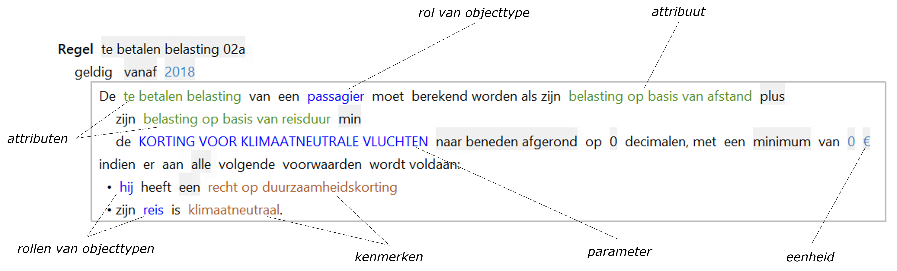

# Objectmodel

Het objectmodel is de basis voor het schrijven van regels in ALEF.

 

 Binnen het gegevensmodel kunnen in een objectmodel de volgende elementen worden gespecificeerd:

* (Extensie van) [objecttypen](objecttype.md)
* [Feittypen](feittype.md)
* [Parameters](parameter.md)
* [Eenheidssystemen](eenheidssysteem.md)
* [Domeinen](domein.md)
* [Dimensies](dimensies.md)
* [Dagsoorten](dagsoort.md)
* [Tijdlijn](tijdlijn.md)

## Objectmodel in GegevensSpraak en RegelSpraak

De meeste regels die in RegelSpraak zijn of worden gemaakt, worden toegepast op objecten. Objecten zijn representaties van dingen in de echte wereld. Deze objecten hebben de eigenschappen die deze personen, objecten of entiteiten hebben en die relevant zijn voor de context (waaronder wetgeving) die gemodelleerd moet worden. Vervolgens kunnen er RegelSpraak-regels gemaakt worden die de eigenschappen van deze persoonsobjecten gebruiken of veranderen.
De objecten en hun eigenschappen worden gespecificeerd met de taal GegevensSpraak. Dit is weliswaar een andere taal dan RegelSpraak, maar we zullen het toch in dit hoofdstuk beschrijven aangezien RegelSpraak de objecten uit GegevensSpraak nodig heeft om te kunnen functioneren.

De waardes van eigenschappen kunnen afkomstig zijn van daadwerkelijke waardes in de echte wereld. De objecten voor personen kunnen bijvoorbeeld een eigenschap geboortedatum hebben. Voordat RegelSpraak-regels op de persoonsobjecten kunnen worden uitgevoerd zal deze eigenschap voor elk persoonsobject een waarde moeten krijgen die overeenkomt met de geboortedatum van een persoon in de echte wereld. Hoe dit precies in zijn werk gaat, is implementatie en valt daarmee buiten het bestek van dit document.

De waardes van eigenschappen kunnen daarnaast ook door RegelSpraak-regels bepaald worden. Als we bijvoorbeeld een object Persoon hebben gespecificeerd met de eigenschappen geboortedatum en leeftijd, en ervoor hebben gezorgd dat de eigenschap geboortedatum de juiste waarde heeft, dan kunnen we een RegelSpraak-regel maken die de eigenschap leeftijd van dit persoonsobject bepaalt op een bepaalde datum.
Objecten in RegelSpraak worden niet opgeslagen, RegelSpraak en GegevensSpraak zijn namelijk geen databases maar specificatietalen waarmee objecten gespecificeerd kunnen worden. Als dezelfde regel wordt uitgevoerd met een andere datum waarvoor de leeftijd moet worden berekend, bijvoorbeeld 12 maart 2023, dan zal als resultaat van die regel de leeftijd de waarde 50 jaar krijgen. De eigenschap geboortedatum houdt dezelfde waarde aangezien deze in de echte wereld (ook) niet verandert.
