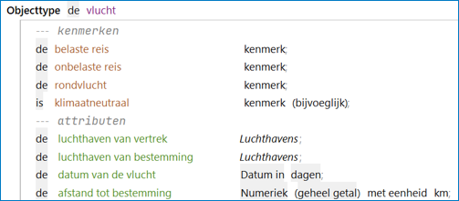
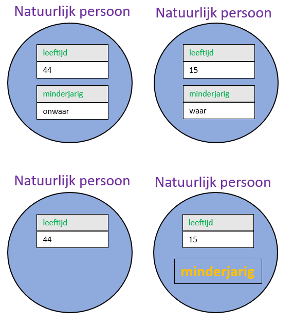
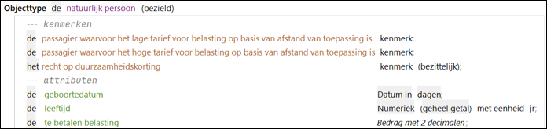
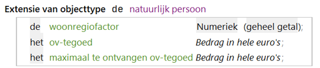

# Objecttype

Objecten in [RegelSpraak](../regels/RegelSpraak.md) en [GegevensSpraak](objectmodel.md) zijn altijd **instanties** van **bepaalde** objecttypen.
Een objecttype definieert een groep gelijksoortige objecten.
Het specificeert welke eigenschappen elk object van dit objecttype heeft.
Als voorbeeld geldt het objecttype *vlucht* dat hieronder staat.
In een RegelSpraak-regel wordt een objecttype gebruikt om aan te geven op welke objecten de regel toegepast moet worden.
In een RegelSpraak-regel kan geen specifieke, unieke instantie worden gebruikt, alleen de verwijzing.
De regel wordt dan opnieuw uitgevoerd voor elke instantie van dat objecttype.
Hierbij kan direct naar het objecttype verwezen worden met behulp van de eigenschappen die het objecttype specificeert of de [rollen](feittype.md) die het objecttype kan spelen.

Bij het uitvoeren van RegelSpraak worden instanties van dit objecttype beschikbaar aan de hand van de invoergegevens.
Een objecttype *Natuurlijk persoon* kan  bijvoorbeeld de eigenschappen geboortedatum en leeftijd hebben.
We kunnen dan een RegelSpraak-regel schrijven om de leeftijd te bepalen op basis van de geboortedatum waarin we gebruik maken van objecttype *Natuurlijk persoon*.
Bij het uitvoeren van RegelSpraak zal voor elk van de instanties de regel worden uitgevoerd: bij elke instantie wordt de leeftijd berekend op basis van de geboortedatum.

Bij objecttypen worden gespecificeerd:

* **Attributen** met [datatype](datatype.md) (en eventueel eenheid en/of dimensies)
* **Kenmerken**

## Attributen

Een eerste belangrijk soort eigenschap betreft het **attribuut**. Een attribuut is een gegeven dat op enig moment een concrete waarde kan of moet hebben.
Een attribuut kan dan ook gezien worden als de representatie van een dergelijk gegeven. Dit is vergelijkbaar met de implementatie in een fysiek datamodel van een relationele database vertaald, oftewel een kolom in de een tabel. Maar het invullen van de data gebeurt niet in het objectmodel.
Een attribuut hoeft overigens geen waarde te hebben. Als het attribuut geen waarde heeft, dan spreken we van een **lege waarde**.

Een attribuut wordt net als een objecttype aangeduid met een naamwoord met daarna een aanduiding van het [datatype](datatype.md): hiermee wordt bepaald welke soort waarden het attribuut kan aannemen. Een attribuut voor een luchthaven van vertrek van een vlucht zal bijvoorbeeld tekstwaarden bevatten (de namen van de luchthavens), maar een attribuut voor de afstand tot de bestemming van de vlucht zal getallen bevatten (het aantal kilometers tussen vertrekpunt en bestemming).

## Kenmerken

Een kenmerk is een eigenschap die een object wel of niet heeft. Deze eigenschap wordt toegekend in regels van het regeltype ["Kenmerktoekenning"](../regels/Actie_Kenmerktoekenning.md).
Het gebruik van kenmerken draagt bij aan de leesbaarheid van regels en voorkomt het veelvuldig opnemen van dezelfde voorwaarden in regels.
Aan het begin zal een kenmerk er niet zijn (onwaar). Alleen als het kenmerk in de invoer wordt gezet of als er een [kenmerktoekenningsregel](../regels/Actie_Kenmerktoekenning.md) toepasbaar is, zal het betreffende kenmerk waar zijn.
Een kenmerk lijkt hierdoor op een [Boolean](datatype.md) attribuut maar het is net iets anders:

1. Je zou bijvoorbeeld een attribuut met datatype Boolean *minderjarig* kunnen hebben. Dit attribuut krijgt de waarde *waar* als de leeftijd van de instantie kleiner is dan 18 jaar en de waarde *onwaar* als dat niet het geval is. Zie de figuur voor een illustratie hiervan waarbij dit verwoord kan worden als “indien minderjarig van de persoon gelijk is aan waar”.
2. Je zou echter ook een kenmerk minderjarig kunnen hebben. Dit kenmerk zal aanwezig zijn bij instanties waarvan de leeftijd kleiner is dan 18 jaar. Zie de figuur voor een illustratie hiervan waarbij dit verwoord kan worden als “indien de persoon minderjarig is”.

Het verschil tussen een attribuut *minderjarig* en een kenmerk *minderjarig* maakt uit voor de weergave in RegelSpraak-regels. Bij Boolean attributen spreken we over een instantie waarvan attribuut *minderjarig* altijd aanwezig is met een de waarde die *waar* of *onwaar* is of (nog) onbekend (*leeg*), terwijl we bij kenmerken spreken over een instantie die minderjarig is indien dat het geval is. **Dit betekent concreet dat een kenmerk in tegenstelling tot een attribuut nooit leeg kan zijn**: als een kenmerk van toepassing is, dan is dat zo en is het kenmerk aanwezig. Er wordt dan ook niet getest op waarde maar op aanwezig zijn. Om de leesbaarheid van RegelSpraak-regels te bevorderen wordt geadviseerd om kenmerken te gebruiken waar dat mogelijk is in plaats van Boolean attributen.

## Bezield en onbezield

Bij een objecttype kan verder aangegeven worden of het objecttype **bezield** is. Hiermee wordt aangegeven of het betreffende objecttype een levend wezen is. Naar bezielde objecttypen kan vervolgens verwezen worden met een verwijzend voornaam woord 'hij' en een bezittelijk voornaamwoord 'zijn'.

 

## Extensies van objecttypen

De volledige specificatie van een objecttype kan worden opgedeeld door extensies van objecttypen te gebruiken. Dit draagt bij aan de overzichtelijkheid van grote gegevensmodellen. Meerdere extenties van hetzelfde object met een clustering van eigenschappen worden aangebracht in aparte delen van het model.

