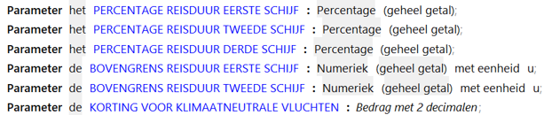
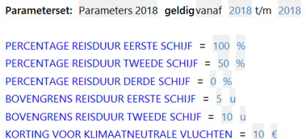

# Parameters

Parameters zijn normen en constanten die
voor ieder geval gelden, onafhankelijk van de invoerwaarden voor attributen.
Voor sommige regels in RegelSpraak zijn algemene gegevens nodig die niet bij een specifiek objecttype horen.
Een tarief is daar een voorbeeld van, of in het voorbeeld de korting voor klimaatneutrale vluchten.
Dit soort gegevens gelden voor alle gevallen die op een bepaald moment in de tijd worden behandeld.
In RegelSpraak kunnen we dit soort gegevens gebruiken door een parameter voor deze gegevens te specificeren.
Een parameter is eigenlijk een soort globaal attribuut: een attribuut dat niet bij een specifiek objecttype hoort en waarvan de waarde binnen de context op elk moment bekend is.
Een parameter moet echter wel altijd, net als een attribuut, een [datatype](datatype.md) hebben.
Als het om een numeriek datatype gaat of om een percentage dan kan er ook een eenheid bij gespecificeerd worden.

In parametersets worden waarden aan parameters toegekend met een bepaalde geldigheid:

## Tips voor gebruik parameters

In verband met beheer- en aanpasbaarheid van RegelSpraak-regels worden parameters doorgaans ook gebruikt om belangrijke waarden buiten objecten op te slaan.
Dit voorkomt dat losse cijfers hard (dat wil zeggen niet aanpasbaar in het objectmodel) in de regels gezet worden.
Een voorbeeld is een tarief of percentage.
Een apart construct kan hierbij gemaakt worden voor bijvoorbeeld het getal 0, denk dan aan het geforceerd gelijkstellen op 0 indien het resultaat van een berekening negatief is gebleken.
