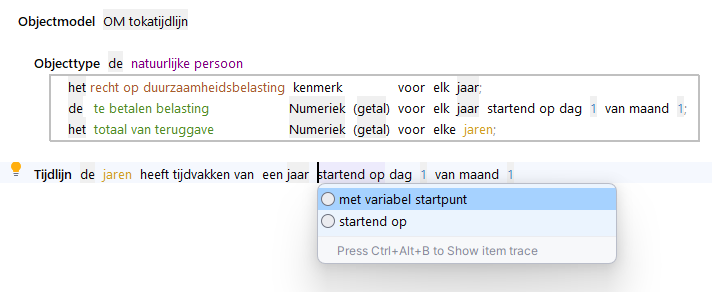

# Tijdlijnen

Attributen, kenmerken en parameters kunnen tijdsafhankelijk zijn. Hiermee wordt bedoeld dat de waarde van een attribuut of parameter of het al dan niet hebben van een kenmerk in de tijd kan veranderen. Oftewel: De waarde kan veranderen, maar dat hoeft niet het geval te zijn.

Als sprake is van tijdsafhankelijke attributen, kenmerken of parameters, dan wordt bij het betreffende element een tijdlijn opgenomen. Met die tijdlijn wordt aangegeven op welke momenten in de tijd een waarde kan veranderen.

Met een intentie kan een attribuut of kenmerk tijdsafhankelijk gemaakt worden. Met de cursor op de laatste positie van de regel kan *startend op*  worden ingevuld. Het startpunt van een tijdlijn kan ook variabel zijn.

## Tijdseenheden en startpunten

De kleinst mogelijke tijdseenheid dat een waarde kan wijzigen is de dag. Een specificatie waarbij verschillende waarden binnen 1 dag kunnen voorkomen, is niet mogelijk. Bij toepassing van de tijdlijn voor elke dag kan op iedere dag een andere waarde gelden. Bijvoorbeeld:

De mogelijkheden om een tijdlijn te defini?ren zijn:

* Enkelvoudige tijdseenheid op basis van de (gregoriaanse) kalender. Dit zijn de volgende tijdseenheden:
    1. Dag
    2. Maand
    3. Kwartaal
    4. Jaar

    De perioden die hierbij worden gebruikt komen precies overeen met de perioden volgens de kalender.
* Enkelvoudige tijdseenheid met een afwijkend vast startpunt;
Hierbij worden ook de tijdseenheden van de kalender gebruikt, maar wordt een afwijkend startpunt van de perioden gespecificeerd
* Meervoudige tijdseenheden;  Hierbij worden periodes gedefinieerd van veelvouden van de standaard tijdseenheden.In dit geval is het vereist om een datum als startpunt op te geven.
Uitzondering op het verplicht toevoegen van een startpunt zijn de gevallen waarbij een veelvoud van een meervoudige periode exact in een kalenderjaar past.
Bijvoorbeeld een periode van 4 maanden. Drie maal 4 maanden zijn precies de 12 maanden van een kalenderjaar. Hetzelfde geldt voor perioden van 3 of 6 maanden. In deze gevallen hoeft er geen startpunt te worden toegevoegd, maar kan dat wel.
* Tijdlijn met variabel startpunt; Dit is een tijdlijn waarvan het startpunt wordt bepaald door de waarde van een attribuut of parameter uit het model.
De tijdlijn zelf wordt apart gespecificeerd in het objectmodel. Hierin wordt de periode gespecificeerd met de aanvulling *met variabel startpunt*:
Daarna kan de tijdlijn worden gekoppeld aan een attribuut, kenmerk of parameter. Welk attribuut of welke parameter het startpunt bepaalt, wordt voor die tijdlijn gespecificeerd in een Startpuntbepalingsregel.

**Let op:** als een tijdlijn wordt gespecificeerd met als startpunt een specifieke datum dan betekent dat niet dat er geen tijdvakken kunnen zijn vóór die datum.
Het startpunt markeert uitsluitend het centrale punt waarop een knip in de totale tijdlijn kan worden geplaatst en van waaraf periodes kunnen worden afgeleid.
Dat kunnen periodes vóór of na dat startpunt zijn.
Het startpunt is het startpunt voor de indeling van de totale tijdlijn.
