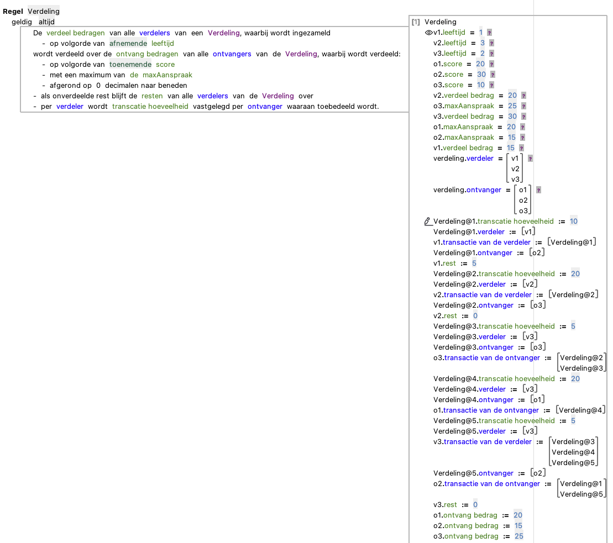
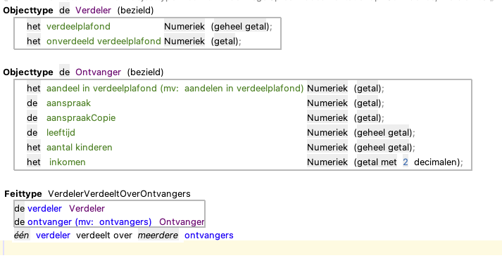
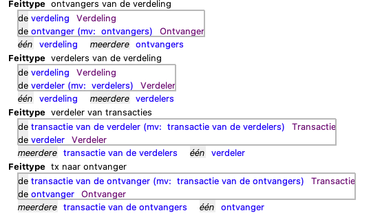
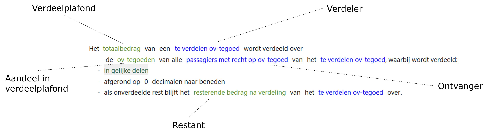
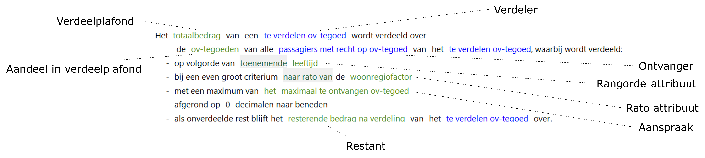
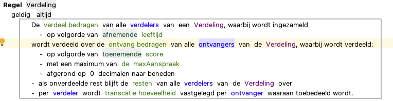

# Verdeling

Doel van deze actie is het verdelen van een te verdelen hoeveelheid (Verdeelplafond) die beschikbaar is bij één of meerdere Verdelers naar te ontvangen hoeveelheden (aandeel in verdeelplafond) bij de Ontvangers.

Als niet het hele verdeelplafond wordt toegerekend aan ontvangers (door afronding of aanspraak) dan wordt een restant berekend voor iedere Verdeler.

Opties binnen de toepassing van de actie:
* Afronden
* Verdelen vanuit één of meerdere verdelers
Verdelingen vanuit meerdere verdelers met verdeelplafonds en restanten. Kan gebruikt worden via de intentie “Verdeel Vanuit Meerdere Verdelers” beschikbaar op de verdeling. Verdelers en ontvangers bieden de volgende optie.
* Verdeling op basis van rangorde
Dit houdt in dat voorkomens van objecten in groepen worden ingedeeld op basis van de toenemende/afnemende volgorde van de waardes in 1 of meerdere attributen (numeriek of datum-tijd)

Ontvangers hebben daarbij ook de volgende opties extra

* Verdelen in **gelijke delen** of **naar rato** van een attribuut.
Verdeeld op basis van het aandeel van een ontvangers gedeeld door het totale aandeel van de ontvangers in de groep (bijvoorbeeld 1/3 voor 1 ontvanger binnen een groep van 3). Naar rato stelt een gebruiker in staat om zelf het aandeel per ontvanger in te stellen. Beide opties kunnen gebruikt worden zonder de **rangorde** optie of in combinatie met de rangorde optie voor groepen groter dan 1. N.B. verdelers hebben deze optie niet dus een verdeling met meerdere verdelers mag nooit groepen groter dan 1 hebben, groepen groter dan 1 worden als inconsistent gemarkeerd.
* De te ontvangen hoeveelheid kan worden beperkt door een **aanspraak**.
De aanspraak bevat de maximale hoeveelheid die een ontvanger toegewezen kan krijgen. Het is alleen mogelijk om een aanspraak op te nemen voor de situatie waarin verdeeld wordt naar rato.

## Transacties

Een Verdeling die verdeeld vanuit meerdere verdelers heeft ook de optie om transacties toe te voegen via de intentie ***voeg transacties toe***. Dit zijn objecten die gecreëerd worden tijdens de verdeling waarin bekeken kan worden hoeveel een verdeler heeft verdeeld naar een ontvanger. Transacties zijn niet beschikbaar als de verdeling verdeeld vanuit een enkele verdeler.

## Relatiemodel voor één of meerdere verdelers

Een enkele verdeler verdeeld over zijn ontvangers. De relatie is één op meer.

Bij meerdere verdelers heeft een verdeling zijn (één op meer) verdelers en (één op meer) ontvangers. Een transactieobject heeft een (aparte) relatie met de verdeler en ontvanger

## Voorbeeld 1 - Verdeling zonder groepen

In dit geval wordt de hoeveelheid die door de Verdeler verdeeld wordt (verdeelplafond) in gelijke delen toegewezen aan de Ontvangers (aandeel in verdeelplafond). 

## Voorbeeld 2 - Verdeling met groepen

In dit geval wordt de hoeveelheid die door de Verdeler verdeeld wordt (verdeelplafond) toegewezen aan de Ontvangers (aandeel in verdeelplafond) op basis van een volgorde die wordt bepaald door een rangorde-attribuut (waarmee de groep wordt gevormd) met een toenemende volgorde.

De aanspraak die een Ontvanger kan hebben wordt bepaald door het aanspraak-attribuut en bepaalt het maximale aandeel in het verdeelplafond voor de Ontvanger. Tenslotte wordt door een rato-attribuut bepaald wat de verdeling moet zijn bij een gelijk criterium.

## Voorbeeld 3 - Verdeling met meerdere verdelers

In dit geval wordt de hoeveelheid die door de Verdelers verdeeld wordt toegewezen aandelen Ontvangers. Ieder deel wordt vastgelegd in een transactie object

