# Beslistabel

De beslistabel is een presentatievorm om gelijkstellingen op te nemen in het regelmodel. 

De beslistabel bevat:

* 1 of meer **Conclusiekolommen**, waarin de toe te kennen waarden staan (de eerste kolom in onderstaande afbeelding),
* 1 of meer **Conditiekolommen**, waarin de voorwaarden staan waaraan voldaan moet worden (de tweede en volgende kolommen), en
* **Rijen**, die overeenkomen met een gelijkstellingsregel (oplopend genummerd). Equivalente regels kunnen worden getoond in de Inspector (zie [paragraaf](#equivalente-regels-in-inspector-bekijken) verderop)

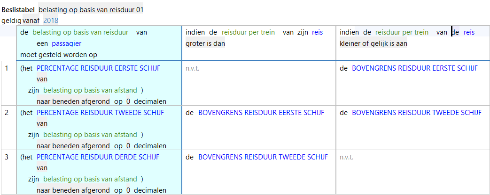

Een beslistabel ziet er altijd zo uit:

* **Conclusiekolommen** staan **links** gegroepeerd en hebben een achtergrondkleur.
* **Conditiekolommen** staan **rechts** gegroepeerd.

## Waarom beslistabel gebruiken

Een beslistabel is hetzelfde als een verzameling normale gelijkstellingsregels, alleen dan weergegeven als tabel. Deze tabelweergave kan de voorkeur hebben om:

* Gerelateerde en/of gelijksoortige regels gegroepeerd weer te geven.
* Overzicht te creëren (bijv. ter beoordeling door een materiedeskundige).
* Te helpen controleren of relevante regels op elkaar aansluiten zonder leemtes te laten.

> *N.B.: Een beslistabel kan in principe ook één regel bevatten, maar in dat geval heeft een beslistabel meestal geen meerwaarde ten opzichte van een normale regel. Kies in dat geval liever voor een gewone regel: het maken van een gewone losse regel is vaak sneller, makkelijker en flexibeler dan het maken dan een beslistabel.*

## Bijzonderheden beslistabel
Hou bij gebruik van beslistabellen rekening met het volgende:

* In een beslistabel kunnen alleen gelijkstellingsregels of kenmerktoekenningen gebruikt worden.
* Voorwaarden in een beslistabel zijn altijd cumulatief (AND): alle voorwaarden moeten waar zijn. Het is niet mogelijk om alternatieve voorwaarden (OR) in een beslistabel op te nemen.
* Bij testen wordt een beslistabel getest als regelgroep: het is niet mogelijk om de losse regels (rijen) uit de beslistabel elk apart te testen zoals dat met normale regels wel kan.

## Beslistabel maken

> *Deze paragraaf gaat ervan uit dat er eerder al een project is aangemaakt in ALEF (tot en met een regelmodel) en dat de lezer ten minste de [ALEF quick-start](../quick-start.md) gelezen heeft en de handelingen daaruit kan uitvoeren. De beslistabel die gemaakt wordt in onderstaand voorbeeld is gebaseerd op - maar niet identiek aan - de TOKA-voorbeeldcasus.*

Een beslistabel wordt als volgt gemaakt in ALEF:

1. Open de gewenste regelgroep en zorg dat de cursor op een lege regel staat. Druk ctrl + spatie en kies `beslistabel`.  
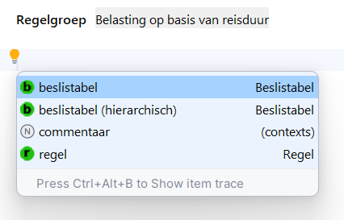
2. Geef de beslistabel een naam en druk op tab.  
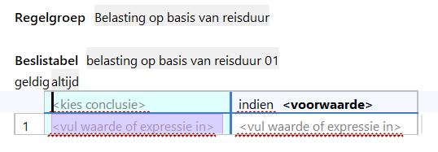
3. Druk ctrl + spatie en kies `gelijkstelling` of `kenmerktoekenning`. In dit voorbeeld wordt `gelijkstelling` gekozen.  
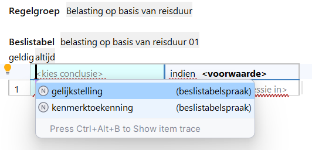  
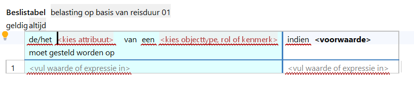
4. Druk ctrl + spatie en kies het attribuut waaraan je een waarde wil toekennen met een regel. In dit voorbeeld wordt `belasting op basis van reisduur` gekozen.  
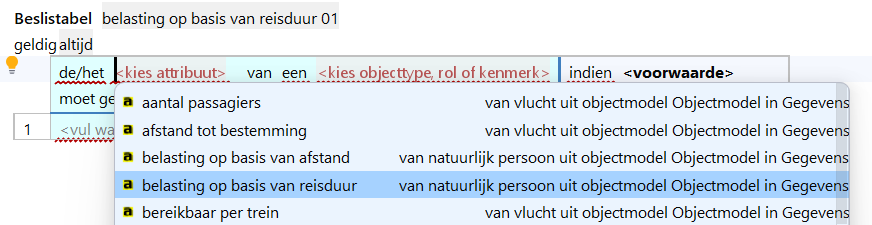  
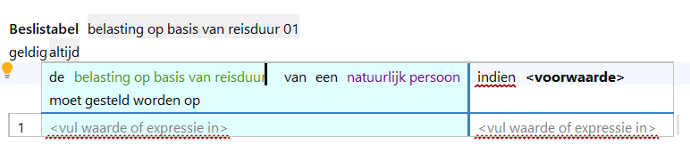
5. Klik in de linker kolom op `<vul waarde of expressie in>`, druk op ctrl + spatie en kies de gewenste optie uit de lijst die verschijnt, bijvoorbeeld `attribuut` of `parameter`. In dit voorbeeld wordt `attribuut` gekozen.  
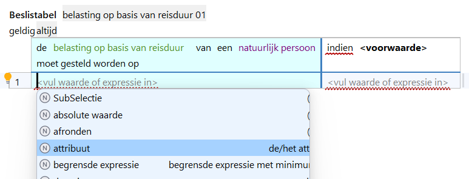  
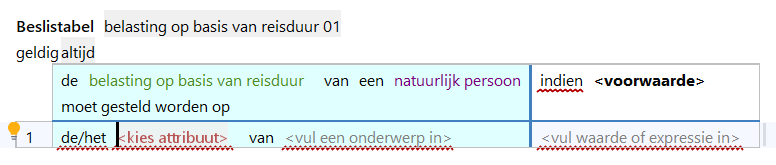
6. Druk ctrl + spatie en kies vervolgens het attribuut `totaal te betalen belasting`.  
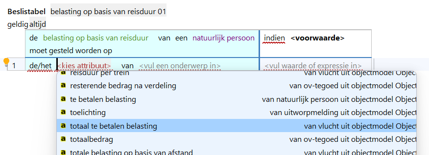  
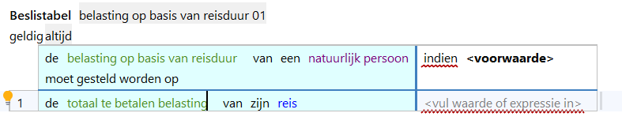
7. Zet in de conditiekolom de cursor direct vóór de `<` van  `<voorwaarde>`, druk op ctrl + spatie en kies (in dit voorbeeld) `indien attribuut ...`.  
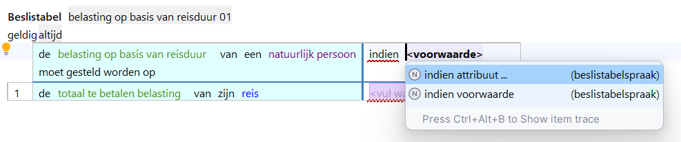  
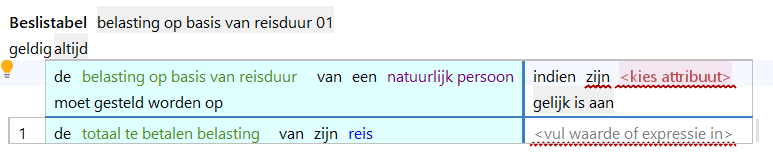
8. Druk op ctrl + spatie en kies attribuut `reisduur per trein`.  
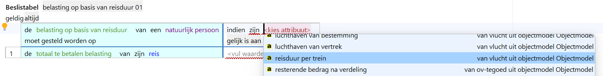  
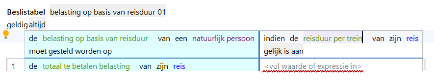
9. Klik eronder op `<vul waarde of expressie in>`, druk op ctrl + spatie en kies (in dit voorbeeld) `parameter`.  
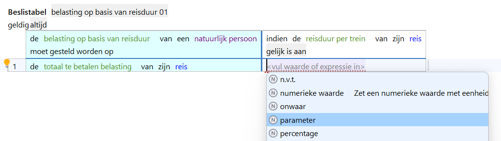  
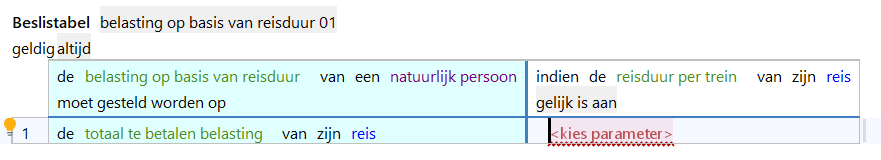
10. Druk ctrl + spatie en kies parameter `BOVENGRENS REISDUUR EERSTE SCHIJF`.  
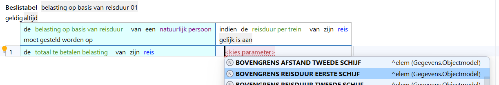  
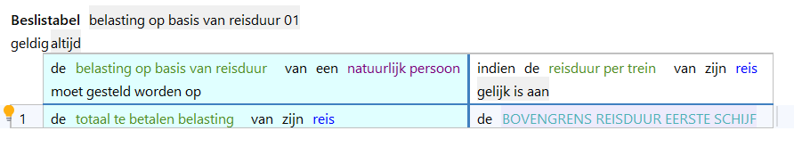

Je hebt nu een beslistabel gemaakt. 

## Beslistabel uitbreiden

> *Je hebt hiervoor een beslistabel gemaakt met 1 regel en 1 voorwaarde. Een nuttige beslistabel zal meestal meer regels bevatten, en vaak ook meer voorwaarden. Je voegt als volgt meer regels (rijen) en voorwaarden (kolommen) toe aan de beslistabel:*

1. Plaats de cursor daar waar je de beslistabel wil uitbreiden (niet bij de nummering).
   1. Een nieuwe **rij** wordt altijd toegevoegd **onder** de rij waar de cursor staat.
   2. Een nieuwe **kolom** wordt altijd toegevoegd **rechts** van de kolom waar de cursor staat.

2. Druk op (Windows) alt + enter of (macOS) ⌥ + enter en kies één van de volgende opties.
    1. Kies `Voeg Rij Toe` om een nieuwe rij/regel toe te voegen, of 
    2.  Kies `Voeg Conditie Kolom Toe` om een nieuwe conditiekolom (voorwaardenkolom) toe te voegen.  
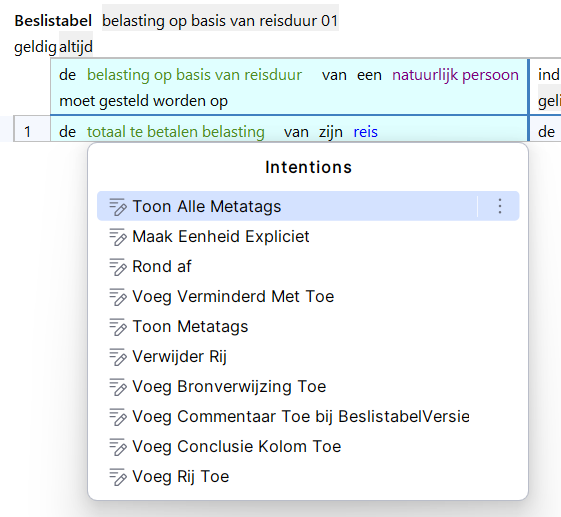

Er verschijnt nu een nieuwe rij (rij 2 in het voorbeeld) of kolom (de nieuwe kolom rechts).   
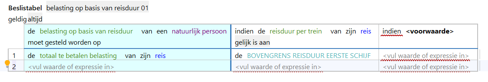

Je kunt de beslistabel nu verder invullen en desgewenst verder uitbreiden zoals hierboven beschreven.

## Indeling beslistabel aanpassen

Je kunt desgewenst de volgorde van rijen en/of kolommen van een beslistabel aanpassen. 

1. Plaats de cursor in de rij of kolom die je wil verplaatsen en druk op (Windows) alt + enter of (macOS) ⌥ + enter.

2. Kies één van de volgende opties.
   1. Kies `Verplaats Deze Conditie Kolom Naar Links` om de conditiekolom waar de cursor staat naar links te verplaatsen.
   2. Kies `Verplaats Deze Conditie Kolom Naar Rechts` om de conditiekolom waar de cursor staat naar rechts te verplaatsen.
   3. Kies `Verplaats Deze Rij Naar Beneden` om de rij waar de cursor staat naar beneden te verplaatsen.
   4. Kies `Verplaats Deze Rij Naar Boven` om de rij waar de cursor staat naar boven te verplaatsen.
   5. Kies `Verplaats Deze Conclusie Kolom Naar Links` om de conclusiekolom waar de cursor staat naar links te verplaatsen.
   6. Kies `Verplaats Deze Conclusie Kolom Naar Rechts` om de conclusiekolom waar de cursor staat naar rechts te verplaatsen.

> In de beslistabel staan alle conclusiekolommen altijd links van alle conditiekolommen: een conclusiekolom kan dus nooit tussen conditiekolommen worden geplaatst of omgekeerd. De bovenste (ongenummerde) rij in de beslistabel kan niet verplaatst worden.

## Beslistabel (deels) verwijderen

1. Om een rij of kolom van de beslistabel te verwijderen plaats je de cursor in de rij of kolom die je wil verwijderen, druk je vervolgens (Windows) alt + enter of (macOS) ⌥ + enter en kies je `Verwijder Rij` of `Verwijder Conclusie Kolom`. 

2. Om de hele beslistabel te verwijderen klik je op het dikgedrukte woord `Beslistabel` bovenaan de beslistabel en druk je op shift + delete. 

## Equivalente regels in Inspector bekijken

Elke rij in een beslistabel is equivalent aan een regel. Deze equivalente regels kunnen in de Inspector in ALEF worden weergegeven.

Open de Inspector in ALEF met de toetsencombinatie:
* Windows: alt + 2. 
* macOS: ⌥ + 2

De Inspector opent gewoonlijk onder in het scherm. 

Klik vervolgens bij een willekeurige beslistabel in je model op het woord `geldig` linksboven de beslistabel. Onderstaande beslistabel ("belasting op basis van reisduur 01") heeft 3 rijen.  

De equivalente regels worden nu per rij in de Inspector getoond.  
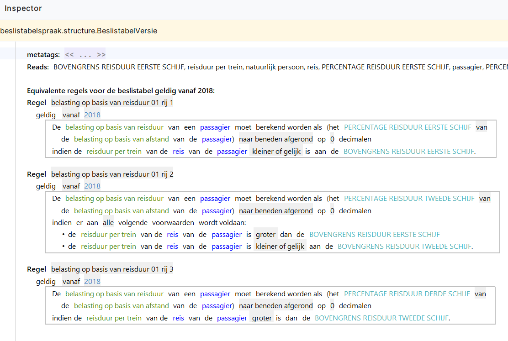